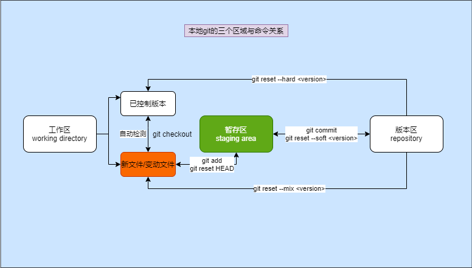
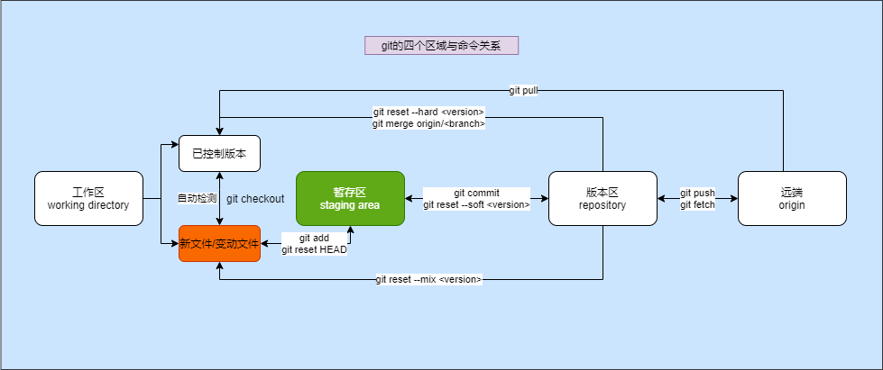
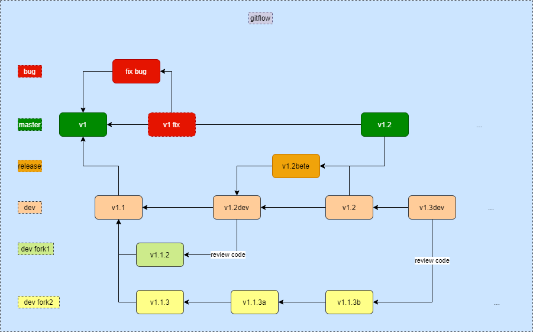

git
===

> 是目前世界上最先进的分布式版本控制系统
>
> PS:本文来自[linux-command/git](https://github.com/jaywcjlove/linux-command/blob/master/command/git.md)

## [导言](https://git-scm.com/book/en/v2/Getting-Started-A-Short-History-of-Git)

[git history](https://www.welcometothejungle.com/en/articles/btc-history-git)

### 英文版

<details>
<summary>简介</summary>

#### In the beginning

Up until April 2005 Torvalds had managed the contributions of a large, disparate team of volunteer developers to  Linux Kernel—the increasingly popular open-source, UNIX-like operating  system—using [BitKeeper](http://www.bitkeeper.org/) (BK). This was a proprietary and paid-for tool at the time, but the  Linux development crew were allowed to use it for free… until BK founder Larry McVoy took issue with one of the Linux developers over  inappropriate use of BK.

From [Torvalds’s announcement](https://marc.info/?l=linux-kernel&m=111280216717070&w=2) to the Linux mailing list about his plan to take a working “vacation”  to decide what to do about finding a new VCS for Linux, it is clear that he liked BK, was frustrated that Linux could no longer use it, and that he was unimpressed by the competition. As mentioned, the outcome of  that vacation was Git. There are several theories why Torvalds called it Git, but the reason is actually just that he liked the word, which he’d learned from the Beatles song [I’m So Tired](https://genius.com/The-beatles-im-so-tired-lyrics) (verse two).

> *“The in-joke was that I name all my projects after myself, and this one was named ‘Git’. Git is [British slang](https://dictionary.cambridge.org/dictionary/english/git) for ‘stupid person’,”* Torvalds tells us. *“There’s a made-up acronym for it, too—Global Information Tracker—but that’s  really a ‘backronym’, [something] made up after the fact.”*

So, is Torvalds surprised by Git’s monumental success? *“I’d be lying if I said I saw it coming. I absolutely didn’t. But Git really did get all the fundamentals right. Were there things that could have  been done better? Sure. But in the big picture, Git really finally  solved some of the really hard problems with VCS,”* he says.

#### Defining Git’s goals

Traditionally, version control was client server, so the code sits in a single  repository —or repo—on a central server. Concurrent Versions System  (CVS), [Subversion](https://en.wikipedia.org/wiki/Apache_Subversion) and Team Foundation Version Control (TFVC) are all examples of client-server systems.

A client-server VCS works fine in a corporate environment, where  development is tightly controlled and is undertaken by an in-house  development team with good network connections. It doesn’t work so well  if you have a collaboration involving hundreds or thousands of  developers, working voluntarily, independently, and remotely, all eager  to try out new things with the code, which is all typical with open  source software (OSS) projects such as Linux.

Distributed VCS,  pioneered by BK, broke that mould. Git, Mercurial, and Monotone all  followed this example. With distributed VCS, a copy of the most current  version of the code resides on each developer’s device, making it easier for developers to work independently on changes to the code. *“BK  was the big conceptual influence for the usage model, and really should  get all the credit. For various reasons, I wanted to make the Git  implementation and logic completely different from BK, but the  conceptual notion of ‘distributed VCS’ really was the number one goal,  and BK taught me the importance of that,”* says Torvalds. *“Being truly distributed means forks are non-issues, and anybody can fork a  project and do their own development, and then come back a month or a  year later and say, ‘Look at this great thing I’ve done.’”*

Another major drawback with client-server VCS, especially for open-source  projects, is whoever hosted the central repository on their server  “owned” the source code. With distributed VCS, however, there is no  central repository, just lots of clones, so nobody owns or controls the  code.

*“[This is what makes] sites like GitHub possible. When  there is no central ‘master’ location that contains the source code, you can suddenly host things without the politics that go along with that  ‘one repo to rule them all’ concept,”* says Torvalds.

Another  central goal was to reduce the pain of merging new branches into the  main source code or “tree” (the directory that makes up the source  code’s hierarchy). Key to this is assigning a cryptographic hash—a  unique and secure number—to index every object. Using hashes wasn’t  unique, but Git took it to a new level, not just applying them to every  new version of file contents, but also using them to identify how they  relate to each other, including trees and the commits. This meant that,  by using ‘git diff’, Git could very quickly identify all the changes  between new/proposed versions of branches and the source code, even  entire trees, by comparing the two indexes of hashes. *“The real  reason for the Git index is to act as that intermediate step for  merging, so that you can incrementally fix conflicts,”* says Torvalds.

This concept of the intermediate step or staging area to allow comparisons  of versions and fix any problems between the main source code and the  additions, before going ahead with the full merge, was revolutionary.  However, it was not universally appreciated by those used to other VCS.

#### Appointing a maintainer

Having written Git, Torvalds threw it open to the open-source community for  review and contributions. Of those who stepped up, one developer in  particular shone through: Junio Hamano. So much so, that after only a  few months, Torvalds could take [a step back](https://marc.info/?l=git&m=112243466603239) and concentrate on Linux, passing over responsibility for maintaining Git to Hamano. *“He had that obvious and all-important but hard-to-describe ‘good taste’ when it came to code and features,”* says Torvalds. *“Junio really should get pretty much all the credit for Git—I started it, and  I’ll take credit for the design, but as a project, Junio is the person  who has maintained it and made it be such a pleasant tool to use.”*

Clearly he was a good choice because he is still leading/maintaining Git 15 years later, as a [benevolent dictator](http://oss-watch.ac.uk/resources/benevolentdictatorgovernancemodel), which means he controls the direction of Git and has the final say on  changes to the code, and he holds the record for the most commits.

#### Widening Git’s appeal

Some of the volunteer contributors who supported Hamano in the early days  still contribute today, although they are often now employed to do it  full time by the companies that rely on Git and want to invest in its  upkeep and improvement.

One of these volunteers was Jeff King,  known as Peff, who started contributing when he was a student. His first commit was in 2006, having spotted and fixed a bug in [git-cvsimport](https://git-scm.com/docs/git-cvsimport), when moving his repositories from CVS to Git. *“I was a graduate student in computer science at the time,”* he says, *“so I spent a lot of time lurking on Git’s mailing list, answering  questions and fixing bugs—sometimes things that bothered me, sometimes  in response to other people’s reports. By around 2008, I had become one  of the main contributors, quite by accident.”* King has been employed by GitHub since 2011, both working on the website and contributing to Git itself.

King singles out the exemplary work of two fellow contributors to Git, who  both started in 2006 and helped to expand its influence beyond the Linux community: Shawn Pearce for his work on [JGit](https://gerrit.googlesource.com/jgit/), which opened up Git to the Java and Android ecosystem, and Johannes  Schindelin, for his work on Git for Windows, which opened up Git to the  Windows community. They subsequently went to work at Google and  Microsoft respectively.

*“[Shawn Pearce] was an early contributor to Git and implemented [git-gui](https://git-scm.com/docs/git-gui), the first graphical interface for Git. But more important is his work on JGit, a pure-Java implementation of Git,”* says King. *“This enabled a whole other ecosystem of Git users and allowed an Eclipse  plugin, which was a key part of the Android project selecting Git as  their version control system. He also wrote [Gerrit](https://www.gerritcodereview.com/) [when at Google], a code-review system based around Git that’s used for Android and many other projects. Sadly, [Shawn passed away in 2018](https://sfconservancy.org/blog/2018/jan/30/shawn-pearce/).”*

Schindelin remains the maintainer of the [Git for Windows distribution](https://gitforwindows.org/) today. *“Because of the way Git grew out of the kernel community, Windows support was mostly an afterthought,”* says King. *“Git has been ported to a lot of platforms, but most of them are vaguely  Unix-ish. Windows was by far the biggest challenge. There were not only  portability issues in the C code, but also the challenges of shipping an application with parts written in Bourne shell, Perl, and so on. Git  for Windows wrangles all of that complexity into a single binary  package, and has had a big impact on the growth of Git for Windows  developers.”*

According to [somsubhra.com](https://www.somsubhra.com/github-release-stats/?username=git-for-windows&repository=git), Git for Windows has been downloaded more than 18m times to date.  

#### Sold

Despite this, the acquisition caused some concern among those GitHub  clients that remember the old Microsoft under the stewardship of the  open-source community’s bête noire, Ballmer. Both Bitbucket and GitLab  claim to have seen a spike in projects moving from GitHub to their  platforms.

That concern is not shared by Torvalds, though. *“I  don’t have any reservations about the MS acquisition, partly because of  the whole fundamental distributed nature of Git—it avoids the political  issues, and it avoids the scary ‘hosting company controls the projects’  part. The other reason I’m not worried is I think MS is a different  company today… Microsoft and open source simply aren’t enemies,”* he says. *“On a purely personal level, when I heard that MS spent a lot of money on  GitHub, it just made me say, ‘Now two of the projects I’ve started have  become billion-dollar industries.’ Not a lot of people can say that. Nor am I just a ‘one-hit wonder.’
“It is part of the ‘life well lived’  thing. It makes me happy that I have made a positive and meaningful  influence on the world. I may not have made any money personally from  Git directly, but it makes it possible for me to do my real job and  passion, [Linux]. And I am not a starving student anymore—I’m doing  quite well as a respected programmer. So other people being successful  with Git in no way upsets me.”*

</details>

### 中文版

<details>
<summary>简介</summary>

#### 在一开始的时候

​       直到 2005 年 4 月，Torvalds 一直使用 BitKeeper (BK) 管理一个庞大的、不同的志愿者开发团队对  Linux Kernel（日益流行的开源、类 UNIX 操作系统）的贡献。当时这是一个专有的付费工具，但 Linux  开发人员被允许免费使用它……[直到 BK 创始人 Larry McVoy 就 BK 的不当使用向其中一位 Linux 开发人员提出异议](https://medium.com/@willhayjr/the-architecture-and-history-of-git-a-distributed-version-control-system-62b17dd37742)。(注：此为澳大利亚计算机程序员 Andrew Tridgell([Samba](https://en.wikipedia.org/wiki/Samba_(software)) [file server](https://en.wikipedia.org/wiki/File_server)的作者) 对 BitKeeper 的源代码进行了逆向工程并违反了其许可证)

​       从  Torvalds 向 Linux [邮件](https://lwn.net/Articles/130681/)列表发布关于他计划休假来决定如何为 Linux 寻找新的 VCS 的公告，很明显他喜欢 BK，对  Linux 无法再使用它感到沮丧，并且他对比赛不感兴趣。如前所述，那个假期的结果是 Git。 Torvalds 将其称为 Git  的原因有多种说法，但实际上只是因为他喜欢这个词，这是他从甲壳虫乐队的歌曲“我太累了”（第二节）中学到的。

> “开玩笑的是，我所有的项目都以我自己的名字命名，而这个项目被命名为‘Git’。 Git 是英国俚语，意思是“愚蠢的人”，”托瓦兹告诉我们。 “它也有一个编造的首字母缩略词——全球信息追踪器——但这确实是一个‘缩略词’，[东西]事后编造的。”

​        那么，Torvalds 是否对 Git 的巨大成功感到惊讶？ “如果我说我看到它来了，那我就是在撒谎。我绝对没有。但是 Git  确实掌握了所有的基础知识。有没有可以做得更好的事情？当然。但从大局来看，Git 最终确实解决了 VCS 的一些非常棘手的问题，”他说。

#### 定义 Git 的目标

​         传统上，版本控制是客户端服务器，因此代码位于中央服务器上的单个存储库或存储库中。并发版本系统 (CVS)、Subversion 和 Team Foundation 版本控制 (TFVC) 都是客户端-服务器系统的示例。

​         客户端-服务器 VCS  在公司环境中运行良好，在该环境中开发受到严格控制并由具有良好网络连接的内部开发团队进行。如果您的协作涉及成百上千的开发人员，他们自愿、独立和远程工作，都渴望用代码尝试新事物，这在开源软件 (OSS) 项目中都是典型的。例如Linux。

​        由 BK 开创的分布式 VCS 打破了这种模式。 Git、Mercurial 和  Monotone 都遵循了这个例子。使用分布式 VCS，最新版本的代码副本驻留在每个开发人员的设备上，使开发人员可以更轻松地独立处理代码更改。  “BK 对使用模型的概念影响很大，真的应该得到所有的赞誉。出于各种原因，我想让 Git 实现和逻辑与 BK 完全不同，但“分布式  VCS”的概念确实是首要目标，而 BK 教会了我这一点的重要性，” Torvalds 说。  “真正的分布式意味着分叉不是问题，任何人都可以分叉一个项目并进行自己的开发，然后一个月或一年后回来说，‘看看我所做的这件伟大的事情。”

​        ”客户端-服务器 VCS 的另一个主要缺点，尤其是对于开源项目，是在其服务器上托管中央存储库的人“拥有”源代码。然而，对于分布式 VCS，没有中央存储库，只有大量克隆，因此没有人拥有或控制代码。

​       “[这就是使] GitHub 之类的网站成为可能的原因。当没有包含源代码的中央‘主’位置时，您可以突然托管一些没有政治的东西，这些东西与‘一个回购统治所有’的概念相一致，”托瓦兹说。

​        另一个中心目标是减少将新分支合并到主源代码或“树”（构成源代码层次结构的目录）的痛苦。其关键是分配一个加密散列——一个唯一且安全的数字——来索引每个对象。使用哈希并不是唯一的，但 Git  将其提升到一个新的水平，不仅将它们应用于文件内容的每个新版本，而且还使用它们来确定它们之间的关系，包括树和提交。这意味着，通过使用“git  diff”，Git 可以通过比较哈希的两个索引，非常快速地识别分支的新/提议版本与源代码之间的所有更改，甚至是整个树。 “Git  索引的真正原因是作为合并的中间步骤，以便您可以逐步修复冲突，”Torvalds 说。

​       在进行完全合并之前，允许比较版本并修复主要源代码和添加之间的任何问题的中间步骤或暂存区域的概念是革命性的。然而，习惯了其他 VCS 的人并没有普遍欣赏它。

#### 任命维护者

​       编写 Git 后，Torvalds 将其公开给开源社区以供审查和贡献。在那些挺身而出的人中，一位特别出色的开发人员：Junio  Hamano。如此之多，以至于仅仅几个月后，Torvalds 就可以退后一步，专注于 Linux，将维护 Git 的责任移交给 Hamano。  Torvalds 说：“在代码和功能方面，他有着明显而重要但难以描述的‘好品味’。” “Junio 真的应该为 Git  赢得几乎所有的荣誉——我开始了它，我将把设计归功于我，但作为一个项目，Junio 是维护它的人，并使它成为一个如此令人愉快的工具使用。”

​        显然他是一个不错的选择，因为 15 年后他仍然在领导/维护 Git，作为一个仁慈的独裁者，这意味着他控制着 Git 的方向，对代码的更改拥有最终决定权，并且他保持着最多的记录提交。

#### 扩大 Git 的吸引力

​        一些早期支持 Hamano 的志愿者贡献者今天仍在贡献，尽管他们现在经常被依赖 Git 并希望投资于其维护和改进的公司全职工作。其中一位志愿者是杰夫·金（Jeff King），他被称为 Peff，他在学生时代就开始做出贡献。他的第一次提交是在 2006 年，当时他发现并修复了 git-cvsimport  中的一个错误，当时他将他的存储库从 CVS 移到了 Git。 “当时我是计算机科学专业的研究生，”他说，“所以我花了很多时间潜伏在 Git  的邮件列表上，回答问题和修复错误——有时是困扰我的事情，有时是为了回应其他人的报告.到 2008  年左右，我成为主要贡献者之一，这完全是偶然的。”自 2011 年以来，King 一直受雇于 GitHub，既在网站上工作，又为 Git  本身做出贡献。

​       King 列举了两位 Git 贡献者的模范工作，他们都始于 2006 年，并帮助将其影响力扩大到 Linux 社区之外：Shawn Pearce 为他在 JGit 上的工作，为 Java 和 Android 生态系统打开了 Git，以及 Johannes  Schindelin，因为他在 Windows 版 Git 上的工作，这使 Git 向 Windows  社区开放。随后，他们分别去了谷歌和微软工作。

​        “[Shawn Pearce] 是 Git 的早期贡献者，并实现了 git-gui，这是 Git  的第一个图形界面。但更重要的是他在 JGit 方面的工作，JGit 是 Git 的纯 Java 实现，”King 说。 “这启用了一个完整的  Git 用户生态系统，并允许使用 Eclipse 插件，这是选择 Git 作为其版本控制系统的 Android 项目的关键部分。他还编写了  Gerrit [在谷歌时]，这是一个基于 Git 的代码审查系统，用于 Android 和许多其他项目。可悲的是，肖恩于 2018 年去世了。

​       ”今天，Schindelin 仍然是 Git for Windows 发行版的维护者。 “由于 Git 从内核社区发展而来的方式，Windows  支持大多是事后才想到的，”King 说。 “Git 已经被移植到很多平台上，但其中大部分都是模糊的 Unix-ish。 Windows  是迄今为止最大的挑战。不仅存在 C 代码中的可移植性问题，而且使用用 Bourne shell、Perl 等编写的部分传送应用程序也存在挑战。  Windows 版 Git 将所有这些复杂性整合到一个二进制包中，并对 Windows 开发人员的 Git 增长产生了重大影响。”

​       据 somsubhra.com 称，迄今为止，Windows 版 Git 的下载量已超过 1800 万次

#### 收购

​          尽管如此，微软的收购还是引起了那些 GitHub 客户的一些担忧，这些客户还记得在开源社区的黑名单鲍尔默的管理下的旧微软。 Bitbucket 和 GitLab 都声称已经看到从 GitHub 转移到他们的平台的项目激增。

​        不过，Torvalds 并不认同这种担忧。 “我对 MS 的收购没有任何保留，部分原因是 Git  的整个基本分布式性质——它避免了政治问题，并且避免了可怕的‘托管公司控制项目’的部分。我不担心的另一个原因是我认为今天的 MS  是一家不同的公司……微软和开源根本不是敌人，”他说。 “纯粹就个人而言，当我听说 MS 在 GitHub  上花了很多钱时，我只想说，'现在我开始的两个项目已经成为十亿美元的产业。' 不是很多人能做到比如说。我也不仅仅是一个“一击必杀的奇迹”。

​       “这是‘过得好生活’的一部分。我对世界产生了积极而有意义的影响，这让我很高兴。我个人可能没有直接从 Git  赚到钱，但它让我有可能做我真正的工作和热情，[Linux]。我不再是一个挨饿的学生——作为一个受人尊敬的程序员，我做得很好。所以其他人在 Git 上取得成功绝不会让我感到不安。”

</details>

[git help book](https://git-scm.com/book/en/v2)

### 版本控制来源

* 文件拷贝
* 本地版本控制
* 集中式版本控制
* 分布式版本控制

### 特点

* Speed
* Simple design
* Strong support for non-linear development (thousands of parallel branches)
* Fully distributed
* Able to handle large projects like the Linux kernel efficiently (speed and data size)

### 语法

```shell
git [--version] [--help] [-C <path>] [-c name=value]
   [--exec-path[=<path>]] [--html-path] [--man-path] [--info-path]
   [-p | --paginate | --no-pager] [--no-replace-objects] [--bare]
   [--git-dir=<path>] [--work-tree=<path>] [--namespace=<name>]
   <command> [<args>]
```

### 选项

```shell
add              将文件内容添加到索引
bisect           通过二进制查找引入错误的更改
branch           列出，创建或删除分支
checkout         检查分支或路径到工作树
clone            将存储库克隆到新目录中
commit           将更改记录到存储库
diff             显示提交，提交和工作树等之间的更改
fetch            从另一个存储库下载对象和引用
grep             打印匹配模式(pattern)的行
init             创建一个空的Git仓库或重新初始化一个现有的
log              显示提交日志
merge            加入两个或更多的开发历史
mv               移动或重命名文件，目录或符号链接
pull             从另一个存储库或本地分支获取并合并
push             更新远程引用以及相关对象
rebase           转发端口本地提交到更新的上游头
reset            将当前HEAD复位到指定状态
rm               从工作树和索引中删除文件
show             显示各种类型的对象
status           显示工作树状态
tag              创建，列出，删除或验证使用GPG签名的标签对象
```

## 操作流程

### init 初始化

> 初始化 :生成仓库目录.git 及子目录 objects, refs/heads, refs/tags和 template files

```bash
git init <options>
```

| 选项 | 说明
|:--:|------|
| --bare | 创建一个空的仓库 |
| -b <branch>| 覆盖原有分支并初始化,<branch>默认为master |

```bash
# git init -h
git init #初始化  
```

### status 获取状态

> 显示仓库的工作目录的状态

```bash
git status [<options>…​] [--] [<pathspec>…​]
```

| 选项 | 说明 |
| :--: | --- |
|  -b | 显示<branch>的跟踪(tracking)信息 |
| -s | 显示简短状态信息 |
| --long | 显示详细状态信息（默认） |

显示简短状态信息的全称，即：`git status -b`

```bash
' ' = unmodified（未修改）

M = modified （已修改）

T = file type changed (文件类型改变)

A = added （添加）

D = deleted （被删除）

R = renamed （重命名）

C = copied (if config option status.renames is set to "copies")

U = updated but unmerged （更新但未合并）
```

```bash
# git status -h
git status #获取状态  #解决git status不能显示中文 -> 问题
# 红色：新增文件/修改的文件 -> git add <file>
# 绿色：git 管理的文件 -> git commit -m '<message>'
# 生成版本
```

* git 的区域划分

  > <font color=blue>工作区（work directory）</font>：跟踪tracked、<font color=red>新增</font>    <font color=green># 跟踪(tracked) -(自动)-> 新增</font>
  >
  > <font color=blue>暂存区(stage area)</font>：     <font color=green># <font color=blue>工作区</font>:<font color=red>新增</font> --(add )–> <font color=green>暂存区</font></font>
  >
  ><font color=blue>版本区(repository)</font>：     <font color=green># <font color=green>暂存区</font> --(commit )–> <font color=green>版本区</font></font>

### add 添加

> 将内容添加到索引(索引(index)：工作树的储存版本)
>
> PS: [git的名词库](https://git-scm.com/docs/gitglossary)

```bash
git add [<options>] [--] <pathspec>...
```

| 选项 | 说明 |
| :---: | --- |
| -A，--all <path>| 添加当前目录下的全部文件（除了.gitignore设置的文件） |
| -u/--update <path>|更新<指定路径下>tracked的文件|

```bash
git add <file> # .或*代表全部添加 (包括tracked 和 untrack 的文件)       
git add -u <path>   # 更新<指定路径下>tracked的文件
# git reset head # 在commit之前撤销git add操作    
```

### .gitignore 文件

> [.gitignore 文件](https://git-scm.com/docs/gitignore)：git忽略管理的文件
>
> 一些常用的 .gitignore的规则：<https://github.com/github/gitignore/>
>
> [配置全局忽略文件](https://blog.csdn.net/Leonxx/article/details/86294617)
>
> | 模式 | 描述   | 例子 |
>  | :--: | ------ | --- |
> |  ！  | 非     | !a.h  <font color=green># 忽略非 a.h 文件，即管理 a.h 文件</font> |
> |  *  | 通配符 | *.py <font color=green># 忽略所有以 .py 结尾的文件</font> |
> | [...]  | 集合 | [a-z].py <font color=green># 忽略一个字母 a-z 和以 .py 结尾的文件</font> |
> | a\|b  | a或b | [a|b].rs <font color=green># 忽略 a.rs 或者 b.rs 的文件</font> |

```bash
# echo "temp" >> ./.gitignore # temp文件
# echo "temp/" >> ./.gitigonre # temp文件夹

git check-ignore temp
```

### commit  提交

> 将变化信息记录到仓库

```bash
git commit [<options>] [--] <pathspec>...
```

| 选项 | 说明
| :---:| ---|
| -m "message"| 提交信息 |
| -a,--all | 提交所有改变的索引文件 |
|  --amend | 修改提交信息 |

```bash
git commit -m "<message>" #此处注意乱码,若出现乱码。 --> 问题 
# 可能会出现需要提交用户身份
# git help config # 获取帮助信息，查看修改个人信息的参数  
# git config --global user.name "Your name"           # 修改全局名字
# git config --global user.email "you@example.com"  # 修改全局邮箱
# git config --list         # 查看配置的信息  

git commit #提交更新   
git commit -m 'message' #提交说明   
git commit -a -m 'message' #跳过使用暂存区域，将所有tracked的文件暂存并提交说明   
git commit --amend #修改最后一次提交      
git commit -m "#133" #关联issue 任意位置带上# 符号加上issue号码  
git commit -m "fix #133" commit关闭issue  
git commit -m '概要描述'$'\n\n''1.详细描述'$'\n''2.详细描述' #提交简要描述和详细描述  
```

`commit`时，使用`语义提交`,即[Understanding Semantic Commit Messages Using ...](https://nitayneeman.com/posts/understanding-semantic-commit-messages-using-git-and-angular)

```sh
#`commit`的格式：
# `Header`[type(scope):subject]、`Body`、`Footer`
git commmit -m "<type>(<scope>):<subject>" -m "<Body>" -m "<Footer>"

# exmaple
git commit -m "fix(core): remove deprecated and defunct wtf* apis" -m "These apis have been deprecated in v8, so they should stick around till v10, but since they are defunct we are removing them early so that they don't take up payload size." -m "PR Close #33949" 
```

```mermaid
graph LR;
    Header --> Type --> buid;
                Type --> ci;
                Type --> docs;
                Type --> feat;
                Type --> fix;
                Type --> perf;
                Type --> refactor;
                Type --> style;
                Type --> test;
    Header --> (Scope);
    Header --> Subject;
    Body;
    Footer;
```

`commit`由三部分组成：`Header`、`Body`、`Footer`

> `Header`:这是必要的，简单描述提交改变的目的
>
> `Body`:【可选】介绍修改的动机与背景或者仅仅是描述更改的细节
>
> `Footer`:【可选】声明更改后的结果，如：声明一个突然的更改、链接一个`issue`、表明`contributors`等
>
| 主干 | 支干 | 分支 | 说明 |
| :---: | :---: | :---:| :---:|
| `Header` | `type` | build/chore | 标记`devlopment`的更改，包括：`build`系统（脚本、配置文件、工具）和包依赖 |
| | | ci | 标记`development`的修改，包括：（`continuous integration`）持续集成和系统部署（脚本、配置、工具） |
| | | docs | 标记`documents`的更改，包括：用户文档与开发文档 |
| | | feat | 标记`production`的变化，包括：新的兼容性能力与新特性（`feature`） |
| | | fix | 标记`production`的修改，包括：`bug`修复(`fix`) |
| | | perf | 标记`production`的改变，包括：性能（`performance`）的提升 |
| | | refactor | 标记`development`的更改，包含：修改底层代码,如移除冗余代码、变量重命名的重构(`refactor`) |
| | | style | 标记`development`的变化，包括：代码的风格（`style`）） |
| | | test | 标记`develop`的更改，包括：重构的测试(`test`)或者新增测试 |
| `Header` | `scope`[可选] | | 代表内容更改的前缀 |
| | `subject` | | 概述实际的更改内容 |
| `Body`[可选] | | | 介绍修改的动机与背景或者仅仅是描述更改的细节 |
| `Footer`[可选] | | | 声明更改后的结果 |

`commit`的例子
<details>
<summary>build</summary>

```plain
build(pm): update fsevents to 1.0.14 (#11686)
build(tsc-wrapped): use tsickleCompilerHost for initial file load
build(docs-infra): update @angular/cli to 9.0.0-rc.0 (#33547)
build(docs-infra): enable ServiceWorker in cli config (#25997) build(common): don't generate .d.ts & metadata.json files for i18n locales build(aio): run the upload server as a non-previleged user
build(gulp): use gulp-watch instead of gulp.watch for watching files
build(docs-infra): upgrade webpack-cli to 3.1.2 (#26202)
```

</details>

<details>
<summary>ci</summary>

```plain
ci (aio): Add payload size limit file
ci(docs-infra): update upload-server to run on node.js v10 (#25554)
ci (docs-infra): re-use
'setup' Circle(I job in aio_monitoring (#30110)
ci (aio): deploy commits on the stable branch to production
ci (docs-infra): increase wait for SW on all origins to avoid CI flakes (#29988)
ci (aio): move eZe tests to optional job (#20178)
ci (publish): fix multiples und files (#11179)
ci(travis): update excluded branch to g3 (#15391)
```

</details>

<details>
<summary>docs</summary>

```plain
docs (changelog): update change log to rc.5
docs (zone.js): update DEVELOPER.md for changelog instruction (#32016)
docs(Core): fix API docs for ContentChild and ViewChildren (#13656)
docs(MockConnection) add mockError usage example (#8888)
docs(router): clarify scroll position wording (#25077)
docs (readme): remove incorrect download count badge
docs(aio): fix typo (#20103)
docs(router): improve docs for Instruction and related classes
```

</details>

<details>
<summary>feat</summary>

```plain
feat(zone.js): support Promise.allSettled (#31849)
feat (ivy): resolve references to vars in .d.ts files (#25775)
feat (aio): implement GithubTeams feat (facade): add bool type
feat (forms): add NgForm method that resets submit state (#10715)
feat(Parser): improve error handling
feat (bazel): add additional parameters to 'ts_api_guardian_test def (#25694)
feat(forms): add na-pending CSS class during async validation (#11243)
```

</details>

<details>
<summary>fix</summary>

```plain
fix(ivy): correctly resolve shorthand property declarations (#28936)
fix (bazel): incorrectly always uses ngc-wrapped from "npm" workspace (#28137)
fix (di): injecting null causes a cyclic dependency fix (ivy): not throwing error for unknown properties on container nodes (#29691) fix (router): make router provides work with cli and offline compilation
fix (ivy): ngtsc - NgtscCompilerHost should cope with directories that look like files (#31289)
fix(ivy): missing schematics field in localize package (#33025)
fix(forms): avoid producing an error with hostBindingTypeCheck
```

</details>

<details>
<summary>perf</summary>

```plain
perf(ivy): don't store public input names in two places (#33798)
perf(ivy): split hooks processing into init and check phases (#32131)
perf(ivy): remove check for function type in renderStringify (#30838)
perf (ivy): removes generation of comments (#21638) perf (change detection): minimized amount of code in protective try-catch
perf (docs-infra): avoid unnecessary I/0 operation in 'ng-packages-installer (#28510) perf (dom): Only send values for existing properties to js interior
perf (core): Make 'PlatformLocation tree-shakable (#32154)
```

</details>

<details>
<summary>refactor</summary>

```plain
refactor (compiler): rename decorator directives into directive
refactor (ivy): remove need for LContainer. template (#24335) refactor (DirectiveResolver): cleanup
refactor (aio): remove redundant styles
refactor(forms): remove facade (#12558)
refactor (core): remove deprecated 'bootstrap' (#10831)
refactor (Shadow(ss): cleanup
refactor (core): simplify & cleanup reflection
```

</details>

<details>
<summary>style</summary>

```plain
style(aio): add space between home and " hamburger
(#23624)
style(bazel): fix 2 unformatted .bzl files
style (core): fix max line length to pass linting (#20441)
style(nodeTree): fix formatting
style(compiler): fix lint issues (#23480)
style(aio): fix indentation on location service spec style(changelog): improving readability (#18949) PR Close #18949 style (playground): use single quotes consistently
```

</details>

<details>
<summary>test</summary>

```plain
test (common): add PercentPipe round and trim tests (#27365)
test(compiler-cli): add test for missingTranslation parameter
test(upgrade): re-enable tests that have been fixed (#27305)
test(ivy): update root causes for @angular/core Tested failures (#27650)
test(docs-infra): fix tests (#26202)
test(ivy): add attribute interpolation test (#30503)
test(ivy): add canonical compiler spec for class/style (#22719)
test(ivy): mark jit_summaries_integration_spec as obsolete in Ivy (#28027)
test(ivy): split out provider tests (#27069)
```

</details>

```shell
# 实质是新建了一个与原来完全相反的commit，抵消了原来commit的效果
git revert <commit-hash> 
```

### log 日志

> 显示提交日志 ,reflog
>
```bash
git log [<options>] [<revision-range>] [[--] <path>...]
```

| 选项 | 说明 | 示例 |
| :---: | --- | --- |
| -\<number\>,-n \<number\> | 显示最近的\<number\>提交 |git log -2 <font color=green>#显示第2条log（倒数）</font> |
| --since,before,util=\<date\> | 显示日志日期范围 | git log --since=1week <font color=green> # 一周内的提交 </font> |
| --grep=\<pattern\> | 使用grep查找提交记录 | git log --grep=fix <font color=green> # 查找提交存在 fix 的记录 </font> |
| -p,--patch \<path\>| 生成补丁查看更改,\<path\>默认为all | git log -1 -p ./a.py <font color=green> # 查看最近一条提交中 a.py 的变化 </font> |
| --pretty=formart:\<string\> | 记录日志的显示格式,其中\<string\>在下面表 | git log --pretty=format:"%h %s"  <font color=green> # 日志显示 hash 和提交说明 </font> |
| --graph | 画出图例 | git log --graph --pretty=format:"%h %s" <font color=green> # 画出log的graph并显示 hash 和 提交说明 </font> |

```bash  
git log #查看最近的提交日志   
git log --pretty=oneline #单行显示提交日志   
git log --graph --pretty=oneline --abbrev-commit      
git reflog #查看所有分支的所有操作记录      
git log --pretty="%h - %s" --author=自己的名字 #查看自己的日志      
# git log --stat #要快速浏览其他协作者提交的更新都作了哪些改动   
git log --pretty=format:"%h - %an, %ar : %s"#定制要显示的记录格式   
git log --pretty=format:'%h : %s' --date-order --graph # 拓扑顺序展示   
git log --pretty=format:'%h : %s - %ad' --date=short #日期YYYY-MM-DD显示   
git log <last tag> HEAD --pretty=format:%s # 只显示commit   
```

|选项 | 说明|选项 | 说明|
|:----:|----|:----:|----|
|%H | 提交对象（commit）的完整哈希字串 |%h | 提交对象的简短哈希字串 |
|  %T  | 树对象（tree）的完整哈希字串       |  %t  | 树对象的简短哈希字串                       |
|  %P  | 父对象（parent）的完整哈希字串     |  %p  | 父对象的简短哈希字串                       |
| %an  | 作者（author）的名字               | %ae  | 作者的电子邮件地址                         |
| %ar  | 作者修订日期，按多久以前的方式显示 | %ad  | 作者修订日期（可以用 -date= 选项定制格式） |
| %cn  | 提交者(committer)的名字            | %ce  | 提交者的电子邮件地址                       |
| %cd  | 提交日期                           |%cr |提交日期，按多久以前的方式显示|
|  %s  | 提交说明                           |      |                                            |

[Pretty Formats](https://git-scm.com/docs/git-log#_pretty_formats)

```bash
# 进行log的格式配置(config)

git config format.pretty oneline  #显示历史记录时，每个提交的信息只显示一行   
git config color.ui true #彩色的 git 输出
git config --global format.pretty '%h : %s - %ad' --date=short #日期YYYY-MM-DD显示 写入全局配置 
```

### reset 回滚/重置

> 重置HEAD到指定状态
>
>PS: HEAD 是对存储库中某个头的引用，除非使用分离的 HEAD，在这种情况下，它直接引用任意提交. --> [git名词库](https://git-scm.com/docs/gitglossary)
>

```bash
git reset [-q] [<tree-ish>] [--] <pathspec>..
git reset [-q] [--pathspec-from-file=<file> [--pathspec-file-nul]] [<tree-ish>]
git reset (--patch | -p) [<tree-ish>] [--] [<pathspec>…]
git reset [--soft | --mixed [-N] | --hard | --merge | --keep] [-q] [<commit>]
```

在前三种形式中，将条目从 \<tree-ish\> 复制到索引。在最后一种形式中，将当前分支头（HEAD）设置为 \<commit\>,\<tree-ish\>/\<commit\> 在所有形式中默认为 HEAD.

```bash
git reset [<mode>] [<commit>] 
```

| 模式选项 | 说明 | 示例 |
| :------: | ----- | ------ |
| --soft \<hash\> | 保留工作区的修改和索引,但撤回提交 | git reset --soft b8d8ad2 <font color=green># \<hash\>可在git log 或者 git reflog</font>|
| --mixed \<hash\>| 重置索引但不改变工作区，即保留修改的文件，但不标记提交（默认） | git reset HEAD 或者 git reset --mixed HEAD <font color=green> # 重置提交 </font>|
| --hard \<hash\> | 重置索引和工作树，即将自提交以来的所有更改都丢弃 | git reset --hard HEAD~3 <font color=green> # 回滚至最近第三个提交之前 </font> |
| -- \<file\> | 撤销文件更改 | git reset -- frotz.c |

---------

最近的三个提交为 HEAD,HEAD^,HEAD~2

通过存储暂存区stash，在删除暂存区的方法放弃本地修改。

```shell
git stash && git stash drop 
```

> **索引(Index)**是您建议的下一次提交,这个概念称为 Git 的**“暂存区”(stage area)**
>
> <https://git-scm.com/book/en/v2/Git-Tools-Reset-Demystified>

|                             | HEAD | Index<br />/stage area | Workdir | WD Safe? |
| --------------------------- | ---- | :--------------------: | ------- | -------- |
| **Commit Level**            |      |                        |         |          |
| `reset --soft [commit]`     | REF  |           NO           | NO      | YES      |
| `reset [commit]`            | REF  |          YES           | NO      | YES      |
| `reset --hard [commit]`     | REF  |          YES           | YES     | **NO**   |
| `checkout <commit>`         | HEAD |          YES           | YES     | YES      |
| **File Level**              |      |                        |         |          |
| `reset [commit] <paths>`    | NO   |          YES           | NO      | YES      |
| `checkout [commit] <paths>` | NO   |          YES           | YES     | **NO**   |

* 撤销添加

```bash
edit                                     # (1)
git add frotz.c filfre.c
mailx                                    # (2)
git reset                                # (3)
git pull git://info.example.com/ nitfol  # (4)

```

* 撤销一个提交并重做

>这通常是在你记得你刚提交的内容不完整，或者你的提交信息拼错了，或者两者都是
>

```bash
git commit ...
git reset --soft HEAD^      # (1)
edit                        # (2)
git commit -a -c ORIG_HEAD  # (3)
```

* 撤销一个提交，使其成为一个主题分支

>你已经做了一些提交，但意识到它们在 "master "分支中还不成熟。 你想在一个主题分支中继续完善它们，所以在当前的`HEAD`之外创建了`topic/wip`分支
>

```bash
git branch topic/wip          # (1)
git reset --hard HEAD~3       # (2)
git switch topic/wip          # (3)
```

* 永久撤销提交

```bash
git commit ...
git reset --hard HEAD~3 # (1)
```

* 撤销合并或撤销拉取

```bash
git pull
git reset --merge ORIG_HEAD 
```

* 打断工作流

> 假设您在进行大的更改时，被紧急修复bug的请求打断了。您的工作树中的文件还没有提交任何状态，但是您需要转到另一个分支以快速修复bug
>

```bash
git switch feature  ;# you were working in "feature" branch and
work work work      ;# got interrupted
git commit -a -m "snapshot WIP"                 # (1)
git switch master
fix fix fix
git commit ;# commit with real log
git switch feature
git reset --soft HEAD^ ;# go back to WIP state  # (2)
git reset                                       # (3)
```

* 重置单个文件索引

```bash
git reset -- frotz.c                      # (1)
git commit -m "Commit files in index"     # (2)
git add frotz.c                           # (3)
```

* 保留工作树中的更改，同时丢弃一些先前的提交

```bash
git tag start
git switch -c branch1
edit
git commit ...                            # (1)
edit
git switch -c branch2                     # (2)
git reset --keep start                    # (3)
```

* 将提交拆分为一系列提交

```bash
$ git reset -N HEAD^                        # (1)
$ git add -p                                # (2)
$ git diff --cached                         # (3)
$ git commit -c HEAD@{1}                    # (4)
...                                         # (5)
$ git add ...                               # (6)
$ git diff --cached                         # (7)
$ git commit ...                            # (8)
```

```shell
git reset --hard FETCH_HEAD # FETCH_HEAD表示上一次成功git pull之后形成的commit点。然后git pull
```

### 小总结（1）



### branch 分支

> 列出、创建或删除分支，注意区别`git submodule`命令!!
>
```bash
usage: git branch [<options>] [-r | -a] [--merged] [--no-merged]
   or: git branch [<options>] [-l] [-f] <branch-name> [<start-point>]
   or: git branch [<options>] [-r] (-d | -D) <branch-name>...
   or: git branch [<options>] (-m | -M) [<old-branch>] <new-branch>
   or: git branch [<options>] (-c | -C) [<old-branch>] <new-branch>
   or: git branch [<options>] [-r | -a] [--points-at]
   or: git branch [<options>] [-r | -a] [--format]
```

| 选项 | 说明 | 示例 |
| :---: | --- | ---- |
| -a,--all | 显示所有(all)分支(默认) | git branch -all<font color=green># 默认(即 git branch) 只显示本地分支(绿色) </font> |
| -l \<pattern\> | 列出(list)指定的分支(默认为本地分支) |  git branch --list  m* <font color=green> # 列出 m 开头的分支 </font> |
| \<branch\> | 在主干上新建分支 |  \<matser\> git branch  todo <font color=green> # 在 master 上创建 todo 分支 </font> |
| -r | 列出远程(remotes)分支（红色） | git branch -r -l o* <font color=green> # 列出远程以 o 开头的分支 </font> |
| -d/-D | 删除/强制删除(delete)分支 | git branch -d todo <font color=green> # 删除 todo 分支 |
| -m/-M | 移动/强制移动(move)分支 | git branch -m dev feature <font color=green> # 将 dev 命名为 feature 分支 |
| -c/-C | 复制/强制拷贝(copy)分支 | git branch -c dev release <font color=green> # 拷贝 dev 为 release 分支 |

```bash
git branch # 查看分支
git branch <branch> # 创建分支
git status # 查看状态，注意区别与原来的主干master

working ...
git add .
git commit -m "<message>"
```

```shell
git branch -v   # 查看各个分支最后一个提交对象的信息   
git branch --merge      # 查看已经合并到当前分支的分支   
git branch --no-merge   # 查看为合并到当前分支的分支
git branch --create-reflog # 创建新的 reflog
```

```shell
git branch --set-upstream dev origin/dev     # 将本地dev分支与远程dev分支之间建立链接  
git branch --set-upstream master origin/next # 手动建立追踪关系  
```

```bash
git push origin :branchName  # 删除远程分支  
git push origin --delete new # 删除远程分支new   
git remote prune origin # 远程删除了，本地还能看到远程存在，这条命令删除远程不存在的分支
```

### switch/checkout 切换分支或恢复工作树文件

> switch:切换到指定分支

```bash
usage: git switch [<options>] [<branch>]

git switch <branch> 
# eg
git switch dev   # 切换到 dev 分支

git switch -c <branch> # 创建(creat)并切换分支
# eg
git switch -c todo # 创建 todo 分支并切换到 todo 分支
```

> checkout:
>切换分支或恢复工作树文件
>

```bash
usage: git checkout [<options>] <branch>
   or: git checkout [<options>] [<branch>] -- <file>...
```

| 选项 | 说明 | 示例 |
| --- | --- | --- |
| -b/-B | 创建/强制创建新分支,并切换到该分支 | git branch -b dev <font color=green> # 创建 dev 分支并切换到 dev 分支 </font> |
...

```bash
git status # 查看状态
git switch <branch> # 切换分支
```

* 以下序列检出 master 分支，将 Makefile 恢复为两个修订版本，错误地删除 hello.c，并从索引中取回它。

```bash
git checkout master             #(1)
git checkout master~2 Makefile  #(2)
rm -f hello.c
git checkout hello.c            #(3)
```

* 在错误的分支中工作后，将使用以下方法切换到正确的分支:

```bash
# However, your "wrong" branch and correct mytopic branch may differ in files that you have modified locally, in which case the above checkout would fail like this:
$ git checkout mytopic
error: You have local changes to 'frotz'; not switching branches.

# You can give the -m flag to the command, which would try a three-way merge:
$ git checkout -m mytopic
# Auto-merging frotz
```

* 当使用 -m 选项切换分支期间发生合并冲突时，您会看到如下内容：

```bash
$ git checkout -m mytopic
Auto-merging frotz
ERROR: Merge conflict in frotz
fatal: merge program failed

#Edit and resolve the conflict and mark it resolved
git diff
edit frotz
git add frotz
```

```shell
git checkout -- file  # 取消对文件的修改（从暂存区——覆盖worktree file）  
git checkout branch|tag|commit -- file_name  # 从仓库取出file覆盖当前分支   
git checkout HEAD~1 [文件]  # 将会更新 working directory 去匹配某次 commit   
git checkout -- .          # 从暂存区取出文件覆盖工作区   
git checkout -b gh-pages  0c304c9  # 这个表示 从当前分支 commit 哈希值为 0c304c9 的节点，分一个新的分支gh-pages出来，并切换到 gh-pages   
```

```shell
# 如果有的修改以及加入暂存区的话
git reset --hard 
# 还原所有修改，不会删除新增的文件
git checkout . 
# 下面命令会删除新增的文件
git clean -xdf
```

```shell
# 这种方式新建的分支(gh-pages)是没有 commit 记录的
git checkout --orphan gh-pages
# 删除新建的gh-pages分支原本的内容，如果不删除，提交将作为当前分支的第一个commit
git rm -rf .
# 查看一下状态 有可能上面一条命令，没有删除还没有提交的的文件
git state 
```

### merge 合并分支

> 将两个或多个开发历史连接在一起
>

```bash
git merge [-n] [--stat] [--no-commit] [--squash] [--[no-]edit]
 [--no-verify] [-s <strategy>] [-X <strategy-option>] [-S[<keyid>]]
 [--[no-]allow-unrelated-histories]
 [--[no-]rerere-autoupdate] [-m <msg>] [-F <file>] [<commit>…​]
git merge (--continue | --abort | --quit)
```

| 选项 | 说明 | 示例 |
| --- | --- | --- |
| --abort | 中止当前的冲突解决过程，并尝试重建合并前的状态。 | (master)git merge dev ;git merge --abort <font color=green># 终止合并dev分支</font>|
| --continue | 继续当前的合并进程 | resolve conflict;git merge --continue <font color=green># 继续合并</font> |
| --squash(挤压) | 创建单个提交信息而非合并 |  |
| --commit | 若合并成功将执行一个提交（默认） |  |

* 在顶级当前分支之上合并分支修复和增强

```bash
git merge fixes enhancements
```

* 合并分支到当前分支中，使用`ours`的**合并策略(strategies)**

```bash
git merge -s ours <branch>
```

> merge的策略(strategies)
>
> **ort** :This is the default merge strategy when pulling or merging one branch. This strategy can only resolve two heads using a 3-way merge algorithm
>
>**ours**: This option forces conflicting hunks to be auto-resolved cleanly by favoring our version. Changes from the other tree that do not conflict with our side are reflected in the merge resul
>
>**theirs**:This is the opposite of `ours`; note that, unlike `ours`, there is no theirs merge strategy to confuse this merge option with.
>

* 合并分支不做提交说明

```bash
git merge --no--commmit <branch>
```

```bash
git status # 查看状态
git switch master
git merge <branch> # 在主分支中合并分支
# 注意：合并时可能会出现冲突，记得解决冲突
# working...
# git add .
# git commit -m "<message>"

# git branch -d <branch> #删除分支

git merge --squash test # 合并压缩，将test上的commit压缩为一条 
```

### 工作提要

>一般的工作流：master –> v1 —> v2 ….
>
>​                       | 分支：dev(开发版) —> V1.1 —> V1.2 …|合并到（master）V2
>
>即一般工作环境会出现至少两个分支：master、development，master即主分支存在正式版/稳定版，development(dev)存放开发版本，开发版成熟则合并至master中，然后在分支dev依次发展

### 线上连接

> github/gitee（网站提供仓库）/gitlab(工具提供生成私有仓库)
>
> ps:[github的高级搜索](https://www.cnblogs.com/catluo/p/11728554.html)，[github官方api帮助文档](https://docs.github.com/cn/rest):[知乎解析GitHub的api](https://zhuanlan.zhihu.com/p/152164873)
>
> pss:[powershell core自动更新](https://blog.lingyf.com/powershell-script-automatically-update-powershell-core/)

* 注册账号

* 创建仓库

* 本地代码推送

```bash
 # 新仓库
echo '# <repository>' >> README.md
git init
git add README.md
git commit -m "first commit"
git remote add origin <url>
git push -u origin master
               
# 已存在的仓库
git remote add origin <url> # 使远程 <url> 成为 变量 origin
git push -u origin master # 推送master分支到远端,并设置为push默认
# git push origin dev # 推送dev分支到远端
```

### remote 远端

> 管理设置已跟踪(tracked)的仓库
>

```bash
usage: git remote [-v | --verbose]
   or: git remote add [-t <branch>] [-m <master>] [-f] [--tags | --no-tags] [--mirror=<fetch|push>] <name> <url>
   or: git remote rename <old> <new>
   or: git remote remove <name>
   or: git remote set-head <name> (-a | --auto | -d | --delete | <branch>)
   or: git remote [-v | --verbose] show [-n] <name>
   or: git remote prune [-n | --dry-run] <name>
   or: git remote [-v | --verbose] update [-p | --prune] [(<group> | <remote>)...]
   or: git remote set-branches [--add] <name> <branch>...
   or: git remote get-url [--push] [--all] <name>
   or: git remote set-url [--push] <name> <newurl> [<oldurl>]
   or: git remote set-url --add <name> <newurl>
   or: git remote set-url --delete <name> <url>
```

| 选项 | 说明 | 示例 |
| :---: | --- | --- |
| add | 添加远端仓库 | git remote add origin \<url\> |
| rename | 远端仓库重命名 | git remote rename dev feature <font color=green> # 重命名 dev 为 feature  </font> | |
| remove | 移除远端仓库 | git remote remove bug <font color=green> # 删除bug </font> ||
| set-head | 设置或删除(-d)默认的远端分支 | |
| set-url | 更改远程的链接(URL) |  |
| show | 显示关于远端的信息 | git remote show origin  <font color=green># 查看指定源的全部信息 </font> |
| update | 更新远端 |  |

* Add a new remote, fetch, and check out a branch from it

```bash
$ git remote
origin
$ git branch -r
  origin/HEAD -> origin/master
  origin/master
$ git remote add staging git://git.kernel.org/.../gregkstaging.git
$ git remote
origin
staging
$ git fetch staging
...
From git://git.kernel.org/pub/scm/linux/kernel/gigregkh/staging
  * [new branch]      master     -> staging/master
  * [new branch]      staging-linus -> staginstaging-linus
 * [new branch]      staging-next -> staging/staging-next
$ git branch -r
  origin/HEAD -> origin/master
  origin/master
  staging/master
  staging/staging-linus
  staging/staging-next
$ git switch -c staging staging/master
...

```

* Imitate git clone but track only selected branches

```bash
mkdir project.git
cd project.git
git init
git remote add -f -t master -m master origin git:example.com/git.git/
git merge origin
```

```bash
git remote add origin git@github.com:JSLite/test.git #添加源 
# 默认添加在本地配置文件中(--local),即：<项目>/.git/config

# 推送3个 git
git remote add origin https://github.com/JSLite/JSLite.git  
git remote set-url --add origin https://gitlab.com/wang/JSLite.js.git  
git remote set-url --add origin https://oschina.net/wang/JSLite.js.git  

# 删除 git 的 remote 地址
git remote set-url --delete origin https://oschina.net/wang/JSLite.js.git
```

> git是一个分布式代码管理工具，所以可以支持多个仓库，在git里，服务器上的仓库在本地称之为remote。个人开发时，多源用的可能不多，但多源其实非常有用。  
>

```shell
git remote add origin1 git@github.com:yanhaijing/data.js.git  
git remote    # 显示全部源  
git remote -v # 显示全部源+详细信息   
```

### push 推送

> 更新远程引用以及关联的对象
>

```bash
usage: git push [<options>] [<repository> [<refspec>...]]

git push [--all | --mirror | --tags] [--follow-tags] [--atomic] [-n | --dry-run] [--receive-pack=<git-receive-pack>]
    [--repo=<repository>] [-f | --force] [-d | --delete] [--prune] [-v | --verbose]
    [-u | --set-upstream] [-o <string> | --push-option=<string>]
    [--[no-]signed|--signed=(true|false|if-asked)]
    [--force-with-lease[=<refname>[:<expect>]] [--force-if-includes]]
    [--no-verify] [<repository> [<refspec>…]]
```

> ps: \<repository\>:远程仓库的目的地 ； \<refspec\>:repositoty
specify 指定的仓库
>

| 选项 | 说明 | 示例 |
| :---: | --- | --- |
| --all | 推送所有分支到远端仓库 | git push --all origin master |
| --prune | 删除没有本地副本的远程分支 |  |
| -d | 所有列出的引用都从远程存储库中删除(delete) |  |
| --tag | 除了明确列出的仓库之外，refs/tags 下的所有 refs 都会被推送 |  |
| -f | 强制(force)推送更新并覆盖原有的仓库，非必要不建议使用 | git push --force origin master  <font color=green># 强制推送master，建议使用 git push origin +master <font> |
| -u | 设置默认上传(set-upstream)分支 | git push -u origin master <font color=green># 设置默认上传(tracked)分支为master <font> |

远端的配置地址的格式：

* $GIT_DIR/config

```bash
 [remote "<name>"]
  url = <url>
  pushurl = <pushurl>
  push = <refspec>
  fetch = <refspec>
```

* $GIT_DIR/remotes

```bash
  URL: one of the above URL format
 Push: <refspec>
 Pull: <refspec>
```

* $GIT_DIR/branches

```bash
<url>#<head>
```

> \<url\> is required; #\<head\> is optional.
>

```bash
git push origin <branch>  
```

git pull的输出状态

```bash
<flag> <summary> <from> -> <to> (<reason>)
```

flag:指示引用状态的单个字符

| 符号 | 说明 |
| :---: | --- |
| \<space\> | 成功快速推送 |
| + | 成功强制更新 |
| - | 成功删除引用 |
| * | 成功推送新引用 |
| ！ | 引用被拒绝或者失败 |
| = | 引用已为最新不需要更新 |

```bash
git push # 推送当前分支到远端

git push origin HEAD # 一种将当前分支推送到远端上相同名称的便捷方法

git push origin HEAD:master # 将当前分支推送到源存储库中的远程 ref 匹配 master。这种形式方便推送当前分支，无需考虑其本地名称。

git push origin master:refs/heads/experimental # 通过复制 master 分支，以在远端创建 experimental 分支

git push origin +dev:master # ...
```

```shell
git reset --hard HEAD~1 # 撤销一条记录   
git push -f origin HEAD:master # 同步到远程仓库  
```

### clone 克隆

> 将存储库克隆到新目录中
>

```bash
usage: git clone [<options>] [--] <repo> [<dir>]

git clone [--template=<template_directory>]
   [-l] [-s] [--no-hardlinks] [-q] [-n] [--bare] [--mirror]
   [-o <name>] [-b <name>] [-u <upload-pack>] [--reference <repository>]
   [--dissociate] [--separate-git-dir <git dir>]
   [--depth <depth>] [--[no-]single-branch] [--no-tags]
   [--recurse-submodules[=<pathspec>]] [--[no-]shallow-submodules]
   [--[no-]remote-submodules] [--jobs <n>] [--sparse] [--[no-]reject-shallow]
   [--filter=<filter>] [--] <repository>
   [<directory>]
```

| 选项 | 说明 |
| :---: | --- |
| -l,--local | 从本地(local)仓库克隆 |
| -s,--share | 从本地分享(share)仓库中克隆 |
| -r,--reference | 从本地引用(reference)中克隆 |
| --bare | 创建一个空仓库 |
---
`git clone --local`时，注意：此操作可以与对源存储库为硬链接的并发修改竞争，类似于在修改 src 时运行 cp -r src dst.

`git clone --share`时，注意：此时共享仓库使用软连接，删改时可能会发生为引用或`dangling`.若要`---share`仓库，同时能够使彼此不产生依赖，建议使用`git repack -a`命令重新打包仓库.

`git clone --refernce`类似`git clone --share`

* Clone from upstream:

```bash
git clone git://git.kernel.org/pub/scm/.../linux.gimy-linux
cd my-linux
make
```

* Make a local clone that borrows from the currendirectory, without checking things out:

```bash
git clone -l -s -n . ../copy
cd ../copy
git show-branch

```

* Clone from upstream while borrowing from an exist in local directory:

```bash
$ git clone --reference /git/linux.git \
  git://git.kernel.org/pub/scm/.../linux.git \
  my-linux
$ cd my-linux
```

* Create a bare repository to publish your changes to thpublic:

```bash
git clone --bare -l /home/proj/.git /pub/scm/proj.git
```

```bash
git clone git://github.com/JSLite/JSLite.js.git
git clone git://github.com/JSLite/JSLite.js.git mypro #克隆到自定义文件夹  
git clone [user@]example.com:path/to/repo.git/ #SSH协议还有另一种写法。 
```

`git clone`支持多种协议，除了HTTP(s)以外，还支持SSH、Git、本地文件协议等，下面是一些例子。`git clone <版本库的网址> <本地目录名>`  

```bash
git clone http[s]://example.com/path/to/repo.git/
git clone ssh://example.com/path/to/repo.git/
git clone git://example.com/path/to/repo.git/
git clone /opt/git/project.git 
git clone file:///opt/git/project.git
git clone ftp[s]://example.com/path/to/repo.git/
git clone rsync://example.com/path/to/repo.git/
```

```bash
# 查看远程仓库状态
git status
git branch # 注意其可能不显示分支但实际上存在分支
# git switch <branch> # 或者 git checkout <branch>
# git status 
```

### pull 拉取

> 从另一个存储库或本地分支获取并集成
>

```bash
usage: git pull [<options>] [<repository> [<refspec>...]]
```

```text
   A---B---C master on origin
  /
    D---E---F---G master
 ^
 origin/master in your repository
```

`git pull之后`

```text
   A---B---C origin/master
  /           \
    D---E---F---G---H master
```

| 选项 | 说明 | 示例 |
| :---: | --- | --- |
| --commit | 执行合并与提交 |  |
| --all | 获取所有远端 | git pull --all <font color=green># 获取远程所有内容包括tag </font> |
| -p,--prune | 在获取之前，修剪(prune)远程上不再存在的任何远程跟踪引用 |  |
| -t,--tags | 获取 tags 远端 |  |

* 更新您从中克隆的存储库的远程跟踪分支，然后将其中一个合并到您的当前分支中：

```bash
git pull
git pull origin
```

* 合并到当前分支到`next`远程分支

```bash
$ git pull origin next # 远程分支是与当前分支合并 

# 上面一条命令等同于下面两条命令   
git fetch origin  
git merge origin/next  
```

```bash
git pull origin <branch> # 从远端拉取代码到工作区
```

只能拉取 `origin` 里的一个url地址，这个fetch-url  
默认为你添加的到 `origin`的第一个地址  

```shell
git pull origin master   

git pull origin next:master # 取回origin主机的next分支，与本地的master分支合并  
```

如果远程主机删除了某个分支，默认情况下，git pull 不会在拉取远程分支的时候，删除对应的本地分支。这是为了防止，由于其他人操作了远程主机，导致git pull不知不觉删除了本地分支。  
但是，你可以改变这个行为，加上参数 -p 就会在本地删除远程已经删除的分支。  

```shell
$ git pull -p
# 等同于下面的命令
$ git fetch --prune origin 
$ git fetch -p
```

### fetch 获取

> 从另一个存储库下载对象和引用
>

```bash
usage: git fetch [<options>] [<repository> [<refspec>...]]
   or: git fetch [<options>] <group>
   or: git fetch --multiple [<options>] [(<repository> | <group>)...]     
   or: git fetch --all [<options>]
```

| 选项 | 说明 | 示例 |
| :---: | --- | --- |
| --all | 获取所有的远端 |  |
| --atomic | 原子(atomic)交易更新获取 |  |
| -t,--tangs | 获取所有 tags 的远端 |  |

git fetch 的输出状态

```bash
<flag> <summary> <from> -> <to> (<reason>)
```

flag:指示引用状态的单个字符

| 符号 | 说明 |
| :---: | --- |
| \<space\> | 成功快速推送 |
| + | 成功强制更新获取 |
| - | 成功修剪(prune)引用 |
| t | 成功更新 tag |
| * | 成功推送新引用 |
| ！ | 引用被拒绝或者失败 |
| = | 引用已为最新不需要更新 |

* 更新远程跟踪分支：

```bash
$ git fetch origin

# 上述命令从远程 refs/heads/ 命名空间复制所有分支并将它们存储到本地 refs/remotes/origin/ 命名空间，除非 branch.<name>.fetch 选项用于指定非默认 refspec。
```

* 明确使用指定仓库：

```bash
$ git fetch origin +seen:seen maint:tmp

# 本地仓库分别根据 seen 和 maint 更新 seen 和 tmp
```

* 查看远程分支，无需在本地存储库中配置远程：

```bash
git fetch git://git.kernel.org/pub/scm/git/git.git maint
git log FETCH_HEAD
```

```bash
# 上面一条命令等同于下面两条命令   
git fetch origin  # 将代码拉取到版本区
git merge origin/<branch>  # 将版本区的代码放到工作区（索引区？）
```

### 小总结（2）



### rebase 变为基类

> 在另一个基本提示之上重新应用提交
>

```bash
usage: git rebase [-i] [options] [--exec <cmd>] [--onto <newbase> | --keep-base] [<upstream> [<branch>]]
   or: git rebase [-i] [options] [--exec <cmd>] [--onto <newbase>] --root [<branch>]
   or: git rebase --continue | --abort | --skip | --edit-todo
```

| 选项 | 说明 | 示例 |
| --- | --- | --- |
|

```shell
git rebase master   # 将master分之上超前的提交，变基到当前分支  
git rebase --onto master 169a6  # 限制回滚范围，rebase当前分支从169a6以后的提交  
git rebase --interactive # 交互模式，修改commit   
git rebase --continue    # 处理完冲突继续合并   
git rebase --skip        # 跳过   
git rebase --abort       # 取消合并
```

```bash
# 1.合并多条commit为一条
git rebase -i HEAD~3 # 合并最近三条commit

# Commands:
# p, pick = use commit
# r, reword = use commit, but edit the commit message
# e, edit = use commit, but stop for amending
# s, squash = use commit, but meld into previous commit
# f, fixup = like "squash", but discard this commit's log message
# x, exec = run command (the rest of the line) using shell
# d, drop = remove commit

# 将pick改为squash(融合),执行后，编写合并的commit
# 注意：最好不合并远端仓库的commit
```

```bash
# 2.分支commit合并到主干，从而去除分支commit
# 2.1 使用merge
git status
git switch <branch>
# working...
git add . ;git commit -m "<message>"
git switch <master>
# working...
git add . ;git commit -m "<message>"
git merge <branch>  # 使用merge
# 可能需要提交一条记录commit
git reflog

# 对比 ： git log --graph --pretty=format:%s

# 2.2 使用rebase
git status
git switch <branch>
# working...
git add . ;git commit -m "<message>"
git switch <master>
# working...
git add . ;git commit -m "<message>"
git checkout <branch>  # 开始使用rebase (1)
git rebase <master>    # 使用rebase (2)
git checkout <master>  # 使用rebase (3)
git merge <branch>     # 使用rebase (4)

# 对比 ： git log --graph --pretty=format:%s
```

```bash
# 3. 远程commit合并
git pull # 产生分支

# 使用rebase
git fetch origin <branch>
git rebase origin/<branch>
```

```bash
# 使用rebase时注意
# 在git rebase时发生冲突（conflict）
# solving...
# git add . 
# git rebase --continue
```

### Beyond compare 快速解决冲突

* 安装 Beyond compare

* 在git中配置

  ```bash
  git config --local merge.tool bc3
  git config --local mergetool.path "<install_path>"
  git config --local mergetool.keepBackup false
  ```

* 应用beyond compare解决冲突

  ```bash
  git mergetool
  ```

## 多人协同开发

### gitflow



### tag

```bash
git tag -a v1 -m "<tag version>" # 打标签
git push origin --tags
```

当开发到一定阶段时，给程序打标签是非常棒的功能。  

```shell
git tag -a v0.1 -m 'my version 1.4' # 新建带注释标签   
git push origin --tags              # 一次性推送所有分支 
git push origin v1.5                # 推送单个tag到orgin源上 
git tag -v v1.4.2.1                 # 验证标签，验证已经签署的标签
git show v1.5                       # 看到对应的 GPG 签

git tag        # 列出现有标签   
git tag v0gi.1 # 新建标签   
git checkout tagname   # 切换到标签       
git tag -d v0.1 # 删除标签   
git push origin :refs/tags/v0.1 # 删除远程标签   
git pull --all # 获取远程所有内容包括tag  
git --git-dir='<绝对地址>/.git' describe --tags HEAD # 查看本地版本信息  
```

### review

```bash
# 在github上的pull/merge request
```

### fork

```bash
# 在github上fork代码
# 在自己的仓库修改
# 给源代码作者提交（即pull request）
```

## 任务管理相关

* issue 提问

> 文档以及任务管理
>

在github --> issue : <type>,<assign>,<status>

* wiki

> 项目描述的百科
>

## **问题**

##### 解决git status不能显示中文

现象：:`git status`查看有改动但未提交的文件时总只显示数字串，显示不出中文文件名，非常不方便。如下图：

原因：在默认设置下，中文文件名在工作区状态输出，中文名不能正确显示，而是显示为[八进制](https://www.zhihu.com/search?q=八进制&search_source=Entity&hybrid_search_source=Entity&hybrid_search_extra={"sourceType"%3A"article"%2C"sourceId"%3A133706032})的字符编码。

解决办法：

将git配置文件 `core.quotepath`项设置为`false`。`quotepath`表示引用路径，加上`--global`表示全局配置

`git bash`终端输入命令：

```text
git config --global core.quotepath false
```

###### 解决git bash 终端显示中文乱码

要注意的是，这样设置后，你的`git bash`终端也要设置成中文和`utf-8`编码。才能正确显示中文.

在`git bash`的界面中右击空白处，弹出菜单，选择`选项->文本->本地Locale`，设置为`zh_CN`，而字符集选框选为`UTF-8`。

英文显示则是：
`Options->Text->Locale`改为`zh_CN`，`Character set`改为`UTF-8`

###### 通过修改配置文件来解决中文乱码

如果你的git bash终端没有菜单选项显示，还可以通过直接修改配置文件的方式来解决中文乱码问题。

进入git的安装目录

编辑`etc\gitconfig`文件，也有些windows系统是存放在`%homepath%\.gitconfig`路径或`安装盘符:ProgramFiles\Git\mingw64\etc\gitconfig`，在文件末尾增加以下内容：

```text
[gui]  
    encoding = utf-8  
    # 代码库统一使用utf-8  
[i18n]  
    commitencoding = utf-8  
    # log编码  
[svn]  
    pathnameencoding = utf-8  
    # 支持中文路径  
[core]
    quotepath = false 
    # status引用路径不再是八进制（反过来说就是允许显示中文了）
```

编辑`etc\git-completion.bash`文件,在文件末尾增加以下内容：

```text
# 让ls命令能够正常显示中文
alias ls='ls --show-control-chars --color=auto' 
```

编辑`.\etc\inputrc`文件，修改`output-meta`和`convert-meta`

属性值：

```text
set output-meta on  # bash可以正常输入中文  
set convert-meta off  
```

编辑`.\etc\profile`文件，在文件末尾添加如下内容：

```text
export LESSHARESET=utf-8
```

## 报错问题解决

**1. `git fatal: protocol error: bad line length character: No s`**

解决办法：更换remote地址为 `http/https` 的  

**2. `The requested URL returned error: 403 Forbidden while accessing`**

解决github push错误的办法：

```shell
#vim 编辑器打开 当前项目中的config文件
vim .git/config

#修改
[remote "origin"]  
    url = https://github.com/jaywcjlove/example.git  

#为下面代码
[remote "origin"]  
    url = https://jaywcjlove@github.com/jaywcjlove/example.git  
```

**3. git status 显示中文问题**

在查看状态的时候 git status 如果是中文就显示下面的情况

```shell
\344\272\247\345\223\201\351\234\200\346\261\202
```

解决这个问题方法是：

```shell
git config --global core.quotepath false
```

## 配置

首先是配置帐号信息 `ssh -T git@github.com` 测试。

```bash
git config --help # 获取帮助信息，查看修改个人信息的参数
```

### 配置的个人信息

* 项目配置文件：<项目>/.git/config

```bash
git config --local user.name "your name"          
git config --local user.email "you@exmaple.com"  
git config --list         # 查看配置的信息  
```

* 全局配置文件：~/.gitconfig

```shell
git config --global user.name "your name"           # 修改全局名字
git config --global user.email "you@exmaple.com"  # 修改全局邮箱
```

* 系统配置文件：/etc/.gitconfig

```bash
# 注意：需要root/管理员权限
git config --system user.name "your name"          
git config --system user.email "you@exmaple.com"  
```

### 配置自动换行

自动转换坑太大，提交到git是自动将换行符转换为lf

```shell
git config --global core.autocrlf input
```

### 配置SSH

#### 创建SSH密钥

这个密钥用来跟 github 通信，在本地终端里生成然后上传到 github

```shell
ssh-keygen -t rsa -C 'wowohoo@qq.com' # 生成密钥  
ssh-keygen -t rsa -C "wowohoo@qq.com" -f ~/.ssh/ww_rsa # 指定生成目录文件名字
ssh -T git@github.com # 测试是否成功  
```

#### 多账号ssh配置

**1.生成指定名字的密钥**

`ssh-keygen -t rsa -C "邮箱地址" -f ~/.ssh/jslite_rsa`  
会生成 `jslite_rsa` 和 `jslite_rsa.pub` 这两个文件  

**2.密钥复制到托管平台上**

`vim ~/.ssh/jslite_rsa.pub`
打开公钥文件 `jslite_rsa.pub` ，并把内容复制至代码托管平台上

**3.修改config文件**

`vim ~/.ssh/config` #修改config文件，如果没有创建 `config`  

```shell
Host jslite.github.com
  HostName github.com
  User git
  IdentityFile ~/.ssh/jslite_rsa

Host work.github.com
  HostName github.com
  # Port 服务器open-ssh端口（默认：22,默认时一般不写此行）
  # PreferredAuthentications 配置登录时用什么权限认证 
  #                          publickey|password publickey|keyboard-interactive等
  User git
  IdentityFile ~/.ssh/work_rsa
```

* `Host` 这里是个别名可以随便命名
* `HostName` 一般是网站如：`git@ss.github.com:username/repo.git` 填写 `github.com`
* `User` 通常填写`git`
* `IdentityFile` 使用的公钥文件地址

**4.测试**

```shell
ssh -T git@jslite.github.com  # `@`后面跟上定义的Host  
ssh -T work.github.com        # 通过别名测试
ssh -i ~/公钥文件地址 Host别名  # 如 ssh -i ~/.ssh/work_rsa work.github.com
```

**5.使用**

```shell
# 原来的写法
git clone git@github.com:<jslite的用户名>/learngit.git
# 现在的写法
git clone git@jslite.github.com:<jslite的用户名>/learngit.git
git clone git@work.github.com:<work的用户名>/learngit.git
```

**6.注意**

如果你修改了id_rsa的名字，你需要将ssh key添加到SSH agent中，如：

```shell
ssh-add ~/.ssh/jslite_rsa
ssh-add -l  # 查看所有的key
ssh-add -D  # 删除所有的key
ssh-add -d  ~/.ssh/jslite_rsa # 删除指定的key
```

### 免密码登录

* https协议下提交代码免密码

```shell
git clone https://github.com/username/rep.git
```

通过上面方式克隆可能需要密码，解决办法：进入当前克隆的项目 `vi rep/.git/config` 编辑 `config`, 按照下面方式修改，你就可以提交代码不用输入密码了。

```shell
[core]
 repositoryformatversion = 0
 filemode = true
 bare = false
 logallrefupdates = true
 ignorecase = true
 precomposeunicode = true
[remote "origin"]
- url = https://github.com/username/rep.git
+ url = https://用户名:密码@github.com/username/rep.git
 fetch = +refs/heads/*:refs/remotes/origin/*
[branch "master"]
 remote = origin
 merge = refs/heads/master
```

* SSH免密登录

```bash
# 1.生成公钥和私钥(默认在 ~/.ssh/)
ssh-keygen -r rsa
# 公钥：id_rsa.pub ，私钥： id_rsa

# 2. 拷贝公钥内容，并设置到GitHub：settings --> "SSH and GPG key" --> key

# 3.在git本地配置ssh地址
git remote add origin <SSH_url>

# 4.以后使用
git push origin <branch>
```

* git自动管理凭证

* 登录远程服务器

```shell
ssh-keygen -t rsa -P '' -f ~/.ssh/aliyunserver.key
ssh-copy-id -i ~/.ssh/aliyunserver.key.pub root@192.168.182.112 # 这里需要输入密码一次
```

编辑 `~/.ssh/config`

```shell
Host aliyun1
  HostName 192.168.182.112
  User root
  PreferredAuthentications publickey
  IdentityFile ~/.ssh/aliyunserver.key
```

上面配置完了，可以通过命令登录，不需要输入IP地址和密码 `ssh aliyun1`

### 合并多个commit

```shell
# 这个命令，将最近4个commit合并为1个，HEAD代表当前版本。
# 将进入VIM界面，你可以修改提交信息。
git rebase -i HEAD~4 
# 可以看到其中分为两个部分，上方未注释的部分是填写要执行的指令，
# 而下方注释的部分则是指令的提示说明。指令部分中由前方的命令名称、commit hash 和 commit message 组成
# 当前我们只要知道 pick 和 squash 这两个命令即可。
# --> pick 的意思是要会执行这个 commit
# --> squash 的意思是这个 commit 会被合并到前一个commit

# 我们将 需要保留的 这个 commit 前方的命令改成 squash 或 s，然后输入:wq以保存并退出
# 这是我们会看到 commit message 的编辑界面

# 其中, 非注释部分就是两次的 commit message, 你要做的就是将这两个修改成新的 commit message。
# 
# 输入wq保存并推出, 再次输入git log查看 commit 历史信息，你会发现这两个 commit 已经合并了。
# 将修改强制推送到前端
git push -f origin master
```

### 修改远程Commit记录

```shell
git commit --amend
# amend只能修改没有提交到线上的，最后一次commit记录
git rebase -i HEAD~3
# 表示要修改当前版本的倒数第三次状态
# 将要更改的记录行首单词 pick 改为 edit
pick 96dc3f9 doc: Update quick-start.md
pick f1cce8a test(Transition):Add transition test (#47)
pick 6293516 feat(Divider): Add Divider component.
# Rebase eeb03a4..6293516 onto eeb03a4 (3 commands)
#
# Commands:
# p, pick = use commit
# r, reword = use commit, but edit the commit message
# e, edit = use commit, but stop for amending
# s, squash = use commit, but meld into previous commit
# f, fixup = like "squash", but discard this commit's log message
# x, exec = run command (the rest of the line) using shell
# d, drop = remove commit
```

保存并退出，会弹出下面提示

```shell
# You can amend the commit now, with
# 
#   git commit --amend
# 
# Once you are satisfied with your changes, run
# 
#   git rebase --continue

# 通过这条命令进入编辑页面更改commit，保存退出
git commit --amend
# 保存退出确认修改，继续执行 rebase, 
git rebase --continue
# 如果修改多条记录反复执行上面两条命令直到完成所有修改

# 最后，确保别人没有提交进行push，最好不要加 -f 强制推送
git push -f origin master
```

### 同步fork的上游仓库

[Github教程同步fork教程](https://help.github.com/articles/syncing-a-fork/)，[在Github上同步一个分支(fork)](http://www.miss77.net/549.html)  

**设置添加多个远程仓库地址。**

在同步之前，需要创建一个远程点指向上游仓库(repo).如果你已经派生了一个原始仓库，可以按照如下方法做。

**同步更新仓库内容**

同步上游仓库到你的仓库需要执行两步：首先你需要从远程拉去，之后你需要合并你希望的分支到你的本地副本分支。从上游的存储库中提取分支以及各自的提交内容。 `master` 将被存储在本地分支机构 `upstream/master`

```shell
git fetch upstream
```

检查你的 fork's 本地 `master` 分支

```shell
git checkout master
# Switched to branch 'master'
```

合并来自 `upstream/master` 的更改到本地 master  分支上。  这使你的前 fork's `master` 分支与上游资源库同步，而不会丢失你本地修改。  

```shell
git merge upstream/master
# Updating a422352..5fdff0f
# Fast-forward
#  README                    |    9 -------
#  README.md                 |    7 ++++++
#  2 files changed, 7 insertions(+), 9 deletions(-)
#  delete mode 100644 README
#  create mode 100644 README.md
```

**2.命令行中运行代码**

OLD_EMAIL原来的邮箱  
CORRECT_NAME更正的名字  
CORRECT_EMAIL更正的邮箱  

将下面代码复制放到命令行中执行

```shell
git filter-branch -f --env-filter '
OLD_EMAIL="wowohoo@qq.com"
CORRECT_NAME="小弟调调"
CORRECT_EMAIL="更正的邮箱@qq.com"
if [ "$GIT_COMMITTER_EMAIL" = "$OLD_EMAIL" ]
then
    export GIT_COMMITTER_NAME="$CORRECT_NAME"
    export GIT_COMMITTER_EMAIL="$CORRECT_EMAIL"
fi
if [ "$GIT_AUTHOR_EMAIL" = "$OLD_EMAIL" ]
then
    export GIT_AUTHOR_NAME="$CORRECT_NAME"
    export GIT_AUTHOR_EMAIL="$CORRECT_EMAIL"
fi
' --tag-name-filter cat -- --branches --tags
```

执行过程

```shell
Rewrite 160d4df2689ff6df3820563bfd13b5f1fb9ba832 (479/508) (16 seconds passed, remaining 0 predicted)
Ref 'refs/heads/dev' was rewritten
Ref 'refs/heads/master' was rewritten
```

**3.同步到远程仓库**

同步到push远程git仓库

```shell
git push --force --tags origin 'refs/heads/*'
```

我还遇到了如下面错误，lab默认给master分支加了保护，不允许强制覆盖。`Project(项目)`->`Setting`->`Repository` 菜单下面的`Protected branches`把master的保护去掉就可以了。修改完之后，建议把master的保护再加回来，毕竟强推不是件好事。

```shell
remote: GitLab: You are not allowed to force push code to a protected branch on this project.
```

当上面的push 不上去的时候，先 `git pull` 确保最新代码

```shell
git pull  --allow-unrelated-histories
# 或者指定分枝
git pull origin master --allow-unrelated-histories
```

### 查看某个文件历史

```shell
git log --pretty=oneline 文件名  # 列出文件的所有改动历史  
git show c178bf49   # 某次的改动的修改记录  
git log -p c178bf49 # 某次的改动的修改记录  
git blame 文件名     # 显示文件的每一行是在那个版本最后修改。  
git whatchanged 文件名  # 显示某个文件的每个版本提交信息：提交日期，提交人员，版本号，提交备注（没有修改细节）  
```

### 打造自己的git命令

```shell
git config --global alias.st status
git config --global alias.br branch
git config --global alias.co checkout
git config --global alias.ci commit
```

配置好后再输入git命令的时候就不用再输入一大段了，例如我们要查看状态，只需：

```shell
git st
```

### 中文乱码的解决方案

```shell
git config --global core.quotepath false
```

## 本地

### rm

```shell
rm *&git rm *          # 移除文件  
git rm -f *            # 移除文件  
git rm --cached *      # 取消跟踪  
git mv file_from file_to  # 重命名跟踪文件  
git log   # 查看提交记录  
```

### revert

```shell
git revert HEAD   # 撤销前一次操作   
git revert HEAD~  # 撤销前前一次操作   
git revert commit # 撤销指定操作   
```

### diff

```shell
git diff file     # 查看指定文件的差异   
git diff --stat   # 查看简单的diff结果   
git diff  # 比较Worktree和Index之间的差异   
git diff --cached   # 比较Index和HEAD之间的差异   
git diff HEAD       # 比较Worktree和HEAD之间的差异   
git diff branch     # 比较Worktree和branch之间的差异   
git diff branch1 branch2  # 比较两次分支之间的差异   
git diff commit commit    # 比较两次提交之间的差异   
git diff master..test   # 上面这条命令只显示两个分支间的差异  
git diff master...test    # 你想找出‘master’,‘test’的共有 父分支和'test'分支之间的差异，你用3个‘.'来取代前面的两个'.'  
```

### stash

```shell
git stash # 将工作区现场（已跟踪文件）储藏起来，等以后恢复后继续工作。   
git stash list  # 查看保存的工作现场   
git stash apply # 恢复工作现场   
git stash drop  # 删除stash内容   
git stash pop   # 恢复的同时直接删除stash内容   
git stash apply stash@{0} # 恢复指定的工作现场，当你保存了不只一份工作现场时。   
```

### cherry-pick

```shell
git cherry-pick commit    # 拣选合并，将commit合并到当前分支   
git cherry-pick -n commit # 拣选多个提交，合并完后可以继续拣选下一个提交   
```

### 拉取

`git fetch -p` #拉取远程分支时，自动清理 远程分支已删除，本地还存在的对应同名分支。  

### 分支合并

```shell
git merge branchName      # 合并分支 - 将分支branchName和当前所在分支合并   
git merge origin/master   # 在本地分支上合并远程分支。   
git rebase origin/master  # 在本地分支上合并远程分支。   
git merge test            # 将test分支合并到当前分支   
```

## 远端

```shell
git fetch <远程主机名> <分支名>   # fetch取回所有分支（branch）的更新  
git fetch origin remotebranch[:localbranch]   #  从远端拉去分支[到本地指定分支]   
git merge origin/branch   # 合并远端上指定分支   
git pull origin remotebranch:localbranch  #  拉去远端分支到本地分支   
git push origin branch    # 将当前分支，推送到远端上指定分支   
git push origin localbranch:remotebranch  # 推送本地指定分支，到远端上指定分支   
git push origin :remotebranch   # 删除远端指定分支   
git checkout -b [--track] test origin/dev # 基于远端dev分支，新建本地test分支[同时设置跟踪]  
```

## submodule

克隆项目同时克隆submodule

```shell
git clone https://github.com/jaywcjlove/handbook.git --depth=1 --recurse-submodules
```

克隆项目，之后再手动克隆 submodule 子项目

```shell
git submodule add --force '仓库地址' '路径'
# 其中，仓库地址是指子模块仓库地址，路径指将子模块放置在当前工程下的路径。
# 注意：路径不能以 / 结尾（会造成修改不生效）、不能是现有工程已有的目录（不能順利 Clone）
git submodule init # 初始化submodule
git submodule update # 更新submodule(必须在根目录执行命令)
git submodule update --init --recursive  # 下载的工程带有submodule
```

当使用`git clone`下来的工程中带有submodule时，初始的时候，submodule的内容并不会自动下载下来的，此时，只需执行如下命令：

```shell
git submodule foreach git pull  # submodule 里有其他的 submodule 一次更新
git submodule foreach git pull origin master # submodule更新

git submodule foreach --recursive git submodule init
git submodule foreach --recursive git submodule update
```

<<<<<<< HEAD
=======

## 删除文件

```shell
git rm -rf node_modules/
```

## 日志log

## 重写历史

```shell
  
```

>>>>>>> 50907bf (git.md add option that is git-log)

[Github官方教程](https://docs.github.com/en/github/writing-on-github)

## 参考资料

* [Git官网](http://git-scm.com/)
* [git 显示中文和解决中文乱码](https://zhuanlan.zhihu.com/p/133706032)
* [git help book](https://git-scm.com/book/zh/v2)
* [**Github 15分钟学习Git**](https://try.github.io)
* [Git参考手册](http://gitref.org/zh/index.html)
* [Git简明手册](http://www.mceiba.com/tool/git-cheat-sheet.html)
* [Git Magic](http://www-cs-students.stanford.edu/~blynn/gitmagic/intl/zh_cn/)
* [Git Community Book 中文版](http://gitbook.liuhui998.com/index.html)
* [Pro Git](http://git-scm.com/book/en/v2)
* [图解Git](http://marklodato.github.io/visual-git-guide/index-zh-cn.html)
* [git-简明指南](http://rogerdudler.github.io/git-guide/index.zh.html)
* [learnGitBranching 在线学习工具](http://pcottle.github.io/learnGitBranching/)
* [初级教程](http://rogerdudler.github.io/git-guide/index.zh.html)
* [廖雪峰的Git教程](http://www.liaoxuefeng.com/wiki/0013739516305929606dd18361248578c67b8067c8c017b000)
* [蒋鑫老师将带你入github的大门](http://www.worldhello.net/gotgithub/)
* [git详解](http://www.open-open.com/lib/view/open1328069609436.html)
* [oschina教程](http://git.oschina.net/progit/)
* [How to undo (almost) anything with Git撤销一切，汇总各种回滚撤销的场景，加强学习。](https://github.com/blog/2019-how-to-undo-almost-anything-with-git)
* [Git 教程 | 菜鸟教程runoob.com](http://www.runoob.com/git/git-tutorial.html)
* [Git 本地仓库和裸仓库](https://gold.xitu.io/post/5842f9b861ff4b005889ade6)
* [沉浸式学 Git](http://www.kancloud.cn/kancloud/igit/46710)
* [Git进阶用法，主要是rebase高级用法](http://way.oschina.io/2016/12/15/notes/GitAdvance/?utm_source=gank.io&utm_medium=email)

<!-- Linux命令行搜索引擎：https://jaywcjlove.github.io/linux-command/ -->
