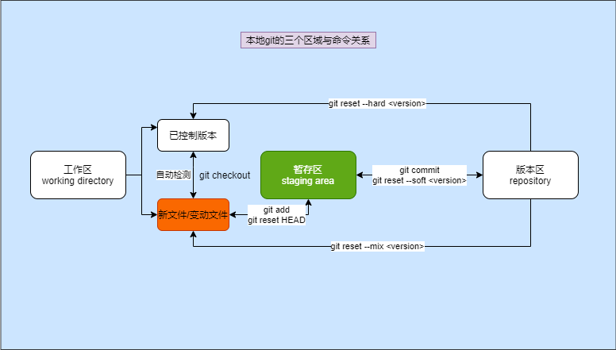
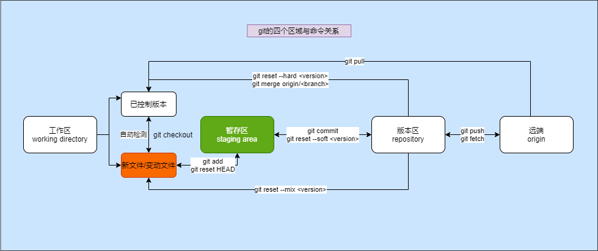
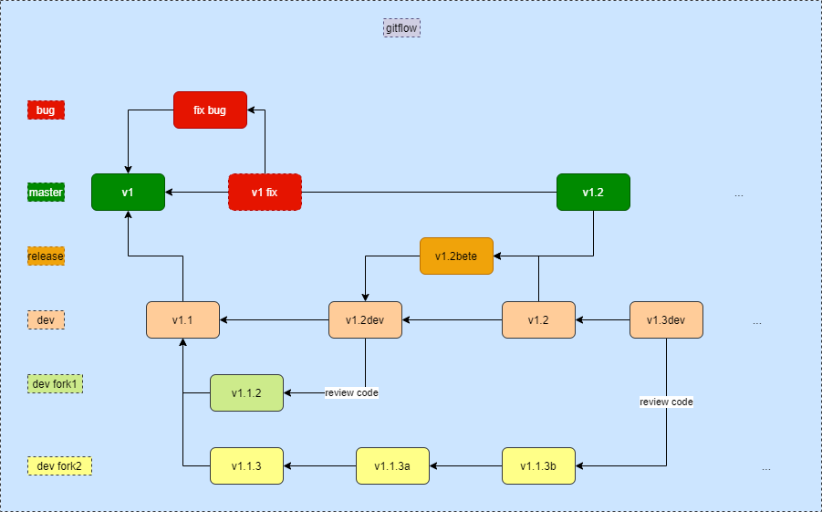

# [learn git](https://github.com/tower-town/learn-git)

这是一个`git`的学习过程手册。一般的教程思路——讲解各个命令的作用。而随着现在涌现出一些新的`git`管理概念的出现，往往`git`未及时跟进，致使之后的学习者需要自己慢慢摸索。而这个`learn-git`将逐步跟进`git`的管理概念与`GitHub`的应用，介绍`git`及其涉及到的领域

## 目录

- [导言](./chapter/ch00-intr.md)
- [Ch01: `git`的命令与流程](./chapter/ch01-gitflow.md)
- [Ch02: `git-init`](./chapter/ch02-git-init.md)
- [Ch03: `git-add`和 gitigore 文件](./chapter/ch03-git-add.md)
- [Ch04: `git-status`](./chapter/ch04-git-status.md)
- [Ch05: `git-commit`与`semantic commit`](./chapter/ch05-git-commit.md)
- [Ch06: `git-log`](./chapter/ch06-git-log.md)
- [Ch07: `git-reset`](./chapter/ch07-git-reset.md)

### 小结

- [Ch08: `git-branch`](./chapter/ch08-git-branch.md)
- [Ch09: `git-switch`或`git-checkout`](./chapter/ch09-git-switch.md)
- [Ch10: `git-merge`](./chapter/ch10-git-merge.md)
- [Ch11: 工作流程](./chapter/ch11-workflow.md)
- [Ch12: `git-remote`](./chapter/ch12-git-remote.md)
- [Ch13: `git-push`](./chapter/ch13-git-push.md)
- [Ch14: `git-clone`](./chapter/ch14-git-clone.md)
- [Ch15: `git-pull`](./chapter/ch15-git-pull.md)
- [Ch16: `git-fetch`](./chapter/ch16-git-fetch.md)
- [Ch17: `git-rebase`](./chapter/ch17-git-rebase.md)

### 小结

## 多人协同开发

- [Ch18: `git-tag`](./chapter/ch18-git-tag.md)
- [Ch19: `Github`](./chapter/ch19-GitHub.md)
- [Ch20: `git-config`](./chapter/ch20-git-config.md)
- [Ch21: `git-submodule`](./chapter/ch21-git-submodule.md)

# 引用

* [linux-command/git](https://github.com/jaywcjlove/linux-command/blob/master/command/git.md) 
* [Git 官网](http://git-scm.com/)
