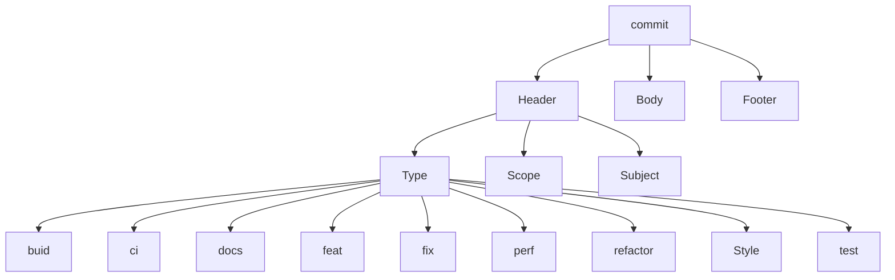

# commit

## commit  提交

> 将变化信息记录到仓库

```bash
git commit [<options>] [--] <pathspec>...
```

| 选项 | 说明
| :---:| ---|
| -m "message"| 提交信息 |
| -a,--all | 提交所有改变的索引文件 |
|  --amend | 修改提交信息 |

```bash
git commit -m "<message>" #此处注意乱码,若出现乱码。 --> 问题 
# 可能会出现需要提交用户身份
# git help config # 获取帮助信息，查看修改个人信息的参数  
# git config --global user.name "Your name"           # 修改全局名字
# git config --global user.email "you@example.com"  # 修改全局邮箱
# git config --list         # 查看配置的信息  

git commit #提交更新   
git commit -m 'message' #提交说明   
git commit -a -m 'message' #跳过使用暂存区域，将所有tracked的文件暂存并提交说明   
git commit --amend #修改最后一次提交      
git commit -m "#133" #关联issue 任意位置带上# 符号加上issue号码  
git commit -m "fix #133" commit关闭issue  
git commit -m '概要描述'$'\n\n''1.详细描述'$'\n''2.详细描述' #提交简要描述和详细描述  
```
## Semantic Commit

`commit`时，使用[`语义提交`](https://nitayneeman.com/posts/understanding-semantic-commit-messages-using-git-and-angular),还有一些补充：https://www.conventionalcommits.org/en/v1.0.0/

```sh
#`commit`的格式：
# `Header`[type(scope):subject]、`Body`、`Footer`
git commmit -m "<type>(<scope>):<subject>" -m "<Body>" -m "<Footer>"

# exmaple
git commit -m "fix(core): remove deprecated and defunct wtf* apis" -m "These apis have been deprecated in v8, so they should stick around till v10, but since they are defunct we are removing them early so that they don't take up payload size." -m "PR Close #33949" 
```



`commit`由三部分组成：`Header`、`Body`、`Footer`

> `Header`:这是必要的，简单描述提交改变的目的
>
> `Body`:【可选】介绍修改的动机与背景或者仅仅是描述更改的细节
>
> `Footer`:【可选】声明更改后的结果，如：声明一个突然的更改、链接一个`issue`、表明`contributors`等
>
| 主干 | 支干 | 分支 | 说明 |
| :---: | :---: | :---:| :---:|
| `Header` | `type` | build/chore | 标记`devlopment`的更改，包括：`build`系统（脚本、配置文件、工具）和包依赖 |
| | | ci | 标记`development`的修改，包括：（`continuous integration`）持续集成和系统部署（脚本、配置、工具） |
| | | docs | 标记`documents`的更改，包括：用户文档与开发文档 |
| | | feat | 标记`production`的变化，包括：新的兼容性能力与新特性（`feature`） |
| | | fix | 标记`production`的修改，包括：`bug`修复 (`fix`) |
| | | perf | 标记`production`的改变，包括：性能（`performance`）的提升 |
| | | refactor | 标记`development`的更改，包含：修改底层代码，如移除冗余代码、变量重命名的重构 (`refactor`) |
| | | style | 标记`development`的变化，包括：代码的风格（`style`）） |
| | | test | 标记`develop`的更改，包括：重构的测试 (`test`) 或者新增测试 |
| `Header` | `scope`[可选] | | 代表内容更改的前缀 |
| | `subject` | | 概述实际的更改内容 |
| `Body`[可选] | | | 介绍修改的动机与背景或者仅仅是描述更改的细节 |
| `Footer`[可选] | | | 声明更改后的结果 |

<details>
<summary>`commit`的例子</summary>

<details>
<summary>build</summary>

```plain
build(pm): update fsevents to 1.0.14 (#11686)
build(tsc-wrapped): use tsickleCompilerHost for initial file load
build(docs-infra): update @angular/cli to 9.0.0-rc.0 (#33547)
build(docs-infra): enable ServiceWorker in cli config (#25997) build(common): don't generate .d.ts & metadata.json files for i18n locales build(aio): run the upload server as a non-previleged user
build(gulp): use gulp-watch instead of gulp.watch for watching files
build(docs-infra): upgrade webpack-cli to 3.1.2 (#26202)
```

</details>

<details>
<summary>ci</summary>

```plain
ci (aio): Add payload size limit file
ci(docs-infra): update upload-server to run on node.js v10 (#25554)
ci (docs-infra): re-use
'setup' Circle(I job in aio_monitoring (#30110)
ci (aio): deploy commits on the stable branch to production
ci (docs-infra): increase wait for SW on all origins to avoid CI flakes (#29988)
ci (aio): move eZe tests to optional job (#20178)
ci (publish): fix multiples und files (#11179)
ci(travis): update excluded branch to g3 (#15391)
```

</details>

<details>
<summary>docs</summary>

```plain
docs (changelog): update change log to rc.5
docs (zone.js): update DEVELOPER.md for changelog instruction (#32016)
docs(Core): fix API docs for ContentChild and ViewChildren (#13656)
docs(MockConnection) add mockError usage example (#8888)
docs(router): clarify scroll position wording (#25077)
docs (readme): remove incorrect download count badge
docs(aio): fix typo (#20103)
docs(router): improve docs for Instruction and related classes
```

</details>

<details>
<summary>feat</summary>

```plain
feat(zone.js): support Promise.allSettled (#31849)
feat (ivy): resolve references to vars in .d.ts files (#25775)
feat (aio): implement GithubTeams feat (facade): add bool type
feat (forms): add NgForm method that resets submit state (#10715)
feat(Parser): improve error handling
feat (bazel): add additional parameters to 'ts_api_guardian_test def (#25694)
feat(forms): add na-pending CSS class during async validation (#11243)
```

</details>

<details>
<summary>fix</summary>

```plain
fix(ivy): correctly resolve shorthand property declarations (#28936)
fix (bazel): incorrectly always uses ngc-wrapped from "npm" workspace (#28137)
fix (di): injecting null causes a cyclic dependency fix (ivy): not throwing error for unknown properties on container nodes (#29691) fix (router): make router provides work with cli and offline compilation
fix (ivy): ngtsc - NgtscCompilerHost should cope with directories that look like files (#31289)
fix(ivy): missing schematics field in localize package (#33025)
fix(forms): avoid producing an error with hostBindingTypeCheck
```

</details>

<details>
<summary>perf</summary>

```plain
perf(ivy): don't store public input names in two places (#33798)
perf(ivy): split hooks processing into init and check phases (#32131)
perf(ivy): remove check for function type in renderStringify (#30838)
perf (ivy): removes generation of comments (#21638) perf (change detection): minimized amount of code in protective try-catch
perf (docs-infra): avoid unnecessary I/0 operation in 'ng-packages-installer (#28510) perf (dom): Only send values for existing properties to js interior
perf (core): Make 'PlatformLocation tree-shakable (#32154)
```

</details>

<details>
<summary>refactor</summary>

```plain
refactor (compiler): rename decorator directives into directive
refactor (ivy): remove need for LContainer. template (#24335) refactor (DirectiveResolver): cleanup
refactor (aio): remove redundant styles
refactor(forms): remove facade (#12558)
refactor (core): remove deprecated 'bootstrap' (#10831)
refactor (Shadow(ss): cleanup
refactor (core): simplify & cleanup reflection
```

</details>

<details>
<summary>style</summary>

```plain
style(aio): add space between home and " hamburger
(#23624)
style(bazel): fix 2 unformatted .bzl files
style (core): fix max line length to pass linting (#20441)
style(nodeTree): fix formatting
style(compiler): fix lint issues (#23480)
style(aio): fix indentation on location service spec style(changelog): improving readability (#18949) PR Close #18949 style (playground): use single quotes consistently
```

</details>

<details>
<summary>test</summary>

```plain
test (common): add PercentPipe round and trim tests (#27365)
test(compiler-cli): add test for missingTranslation parameter
test(upgrade): re-enable tests that have been fixed (#27305)
test(ivy): update root causes for @angular/core Tested failures (#27650)
test(docs-infra): fix tests (#26202)
test(ivy): add attribute interpolation test (#30503)
test(ivy): add canonical compiler spec for class/style (#22719)
test(ivy): mark jit_summaries_integration_spec as obsolete in Ivy (#28027)
test(ivy): split out provider tests (#27069)
```

</details>

</details>

```shell
# 实质是新建了一个与原来完全相反的commit，抵消了原来commit的效果
git revert <commit-hash> 
```
